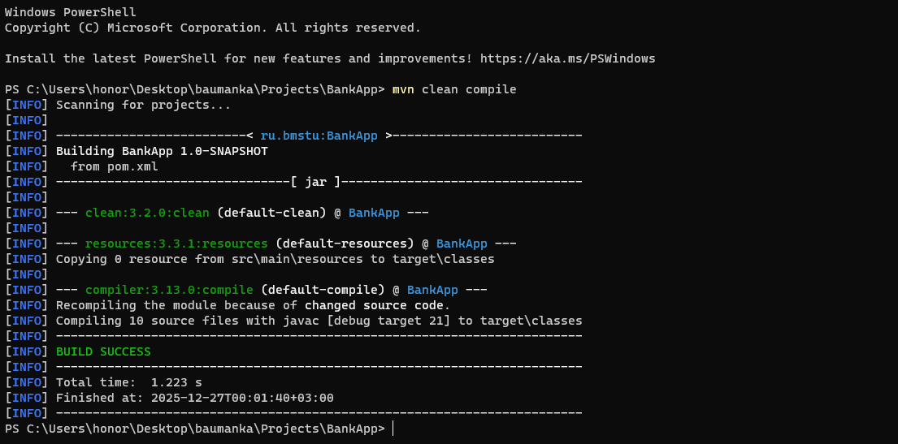
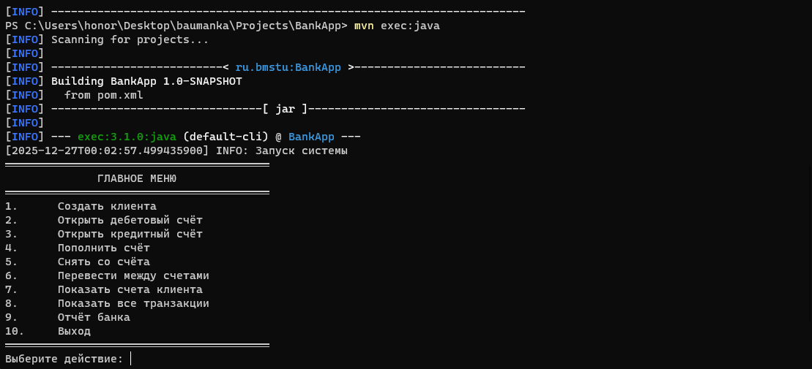
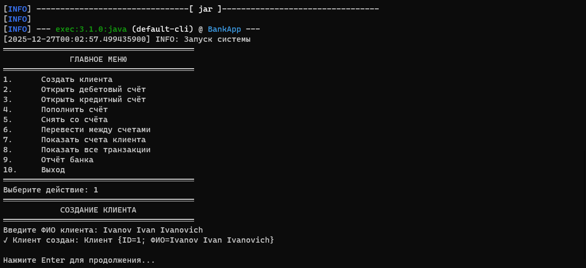
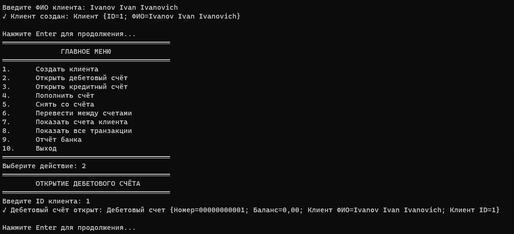
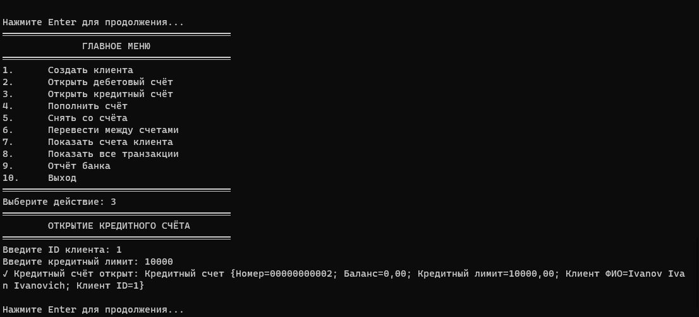
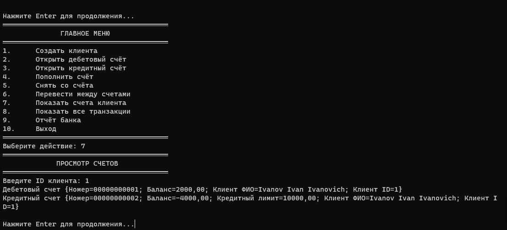
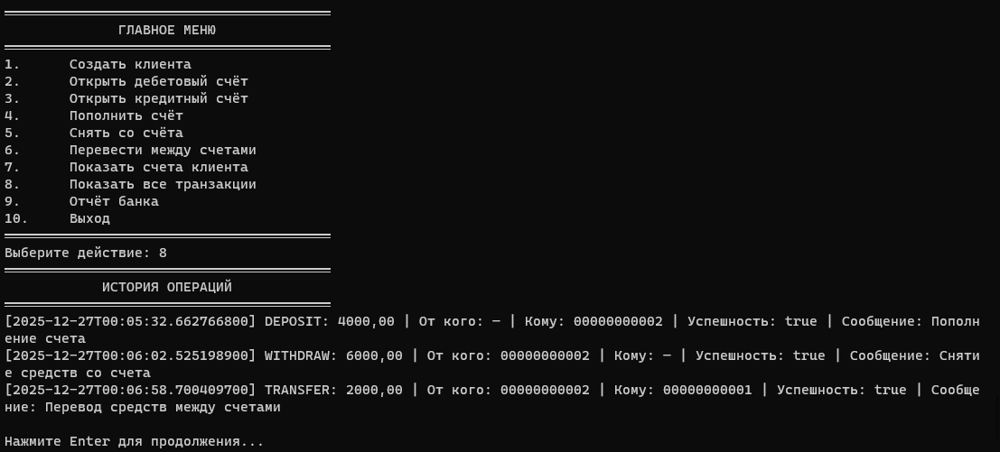
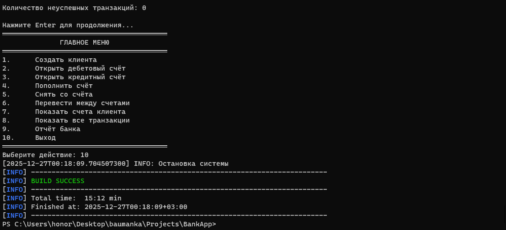

# Банковская система (BankApp)

## О проекте

Консольное приложение для моделирования работы банковской системы с поддержкой дебетовых и кредитных счетов, транзакций и финансовой отчетности.

### Основные возможности
- Создание клиентов банка
- Открытие дебетовых и кредитных счетов
- Пополнение, снятие и перевод средств
- Полная история транзакций
- Финансовая отчетность
- Проверка корректности операций

### Архитектура
Проект реализован с использованием объектно-ориентированного подхода и состоит из следующих компонентов:

```
BankApp/
├── src/main/java/ru/bmstu/
│   ├── Main.java                    # Точка входа
│   ├── controller/
│   │   └── Console.java            # Консольный интерфейс
│   ├── model/                      # Модели данных
│   │   ├── Account.java
│   │   ├── CreditAccount.java
│   │   ├── Customer.java
│   │   ├── DebitAccount.java
│   │   ├── Transaction.java
│   │   └── TransactionType.java
│   └── service/                    # Бизнес-логика
│       ├── Bank.java
│       └── Logger.java
├── pom.xml                         # Maven конфигурация
└── README.md                       # Документация
```

## Запуск проекта

### Требования
- Java 21 или выше
- Maven 3.6+

### Установка и запуск

1. **Клонирование репозитория**
```bash
git clone <repository-url>
cd BankApp
```

2. **Сборка проекта**
```bash
mvn clean compile
```


3. **Запуск приложения**
```bash
mvn exec:java
```


Или используя напрямую Java:
```bash
java -cp target/classes ru.bmstu.Main
```

## Пример работы


### Пример создания клиента


### Пример открытия дебетового счета


### Пример открытия кредитного счета


### Пример пополнения счета


### Пример снятия со счета


### Пример перевода между счетами


### Пример вывода счета клиента


### Пример вывода транзакций


### Пример вывода отчета


### Пример выхода из системы


## Сущности системы

### 1. Клиент (Customer)
- Уникальный ID (автогенерация)
- ФИО клиента

### 2. Счета (Account)
- **Account** - абстрактный базовый класс
- **DebitAccount** - дебетовый счет (без овердрафта)
- **CreditAccount** - кредитный счет (с лимитом кредитования)

### 3. Транзакции (Transaction)
- Тип операции: DEPOSIT, WITHDRAW, TRANSFER
- Сумма операции
- Учет успешности операции
- Детальное сообщение

## Технические особенности

### Валидация операций
- Проверка положительности сумм
- Проверка достаточности средств
- Валидация существования счетов
- Логирование всех операций

### Обработка ошибок
- Защита от некорректного ввода
- Подробные сообщения об ошибках
- Откат транзакций при ошибках

### Логирование
```java
Logger.log("INFO", "Запуск системы");
Logger.log("ERROR", "Ошибка операции");
```

## Структура проекта

### Модели (model/)
- `Account.java` - абстрактный класс счета
- `CreditAccount.java` - кредитный счет с лимитом
- `DebitAccount.java` - дебетовый счет
- `Customer.java` - клиент банка
- `Transaction.java` - транзакция
- `TransactionType.java` - перечисление типов операций

### Сервисы (service/)
- `Bank.java` - основная бизнес-логика
- `Logger.java` - утилита логирования

### Контроллер (controller/)
- `Console.java` - консольный интерфейс

## Примеры использования

### Создание и работа со счетами
```java
// Создание клиента
Customer customer = bank.createCustomer("Иван Иванов Иванович");

// Открытие дебетового счета
Account debit = bank.openDebitAccount(customer);

// Открытие кредитного счета
Account credit = bank.openCreditAccount(customer, 10000);

// Операции со счетами
bank.deposit(debit.getAccountNumber(), 5000);
bank.withdraw(credit.getAccountNumber(), 3000);
bank.transfer(debit.getAccountNumber(), credit.getAccountNumber(), 2000);
```


## Лицензия

MIT License